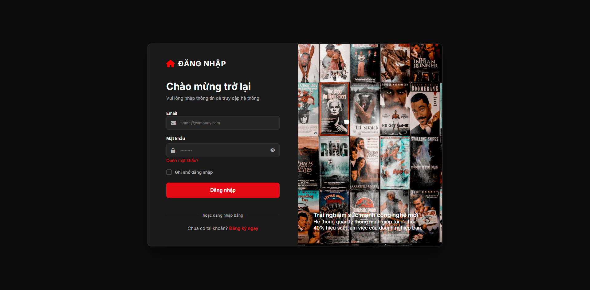
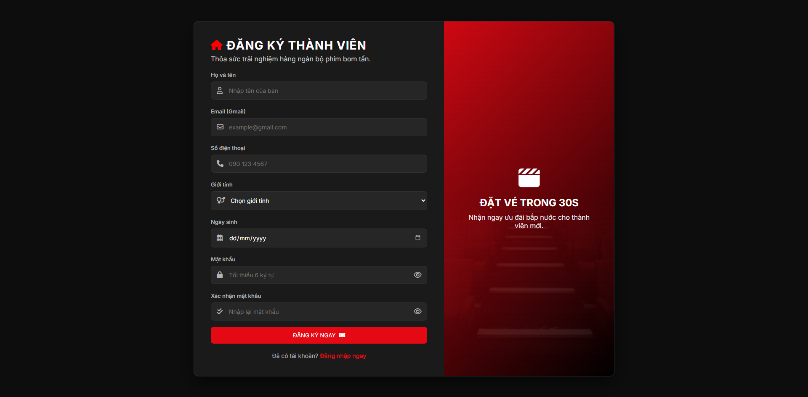
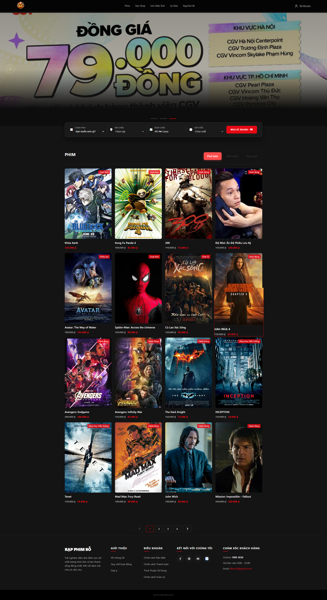
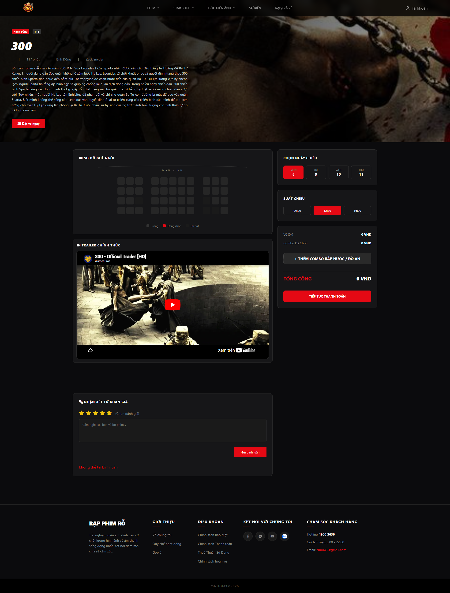
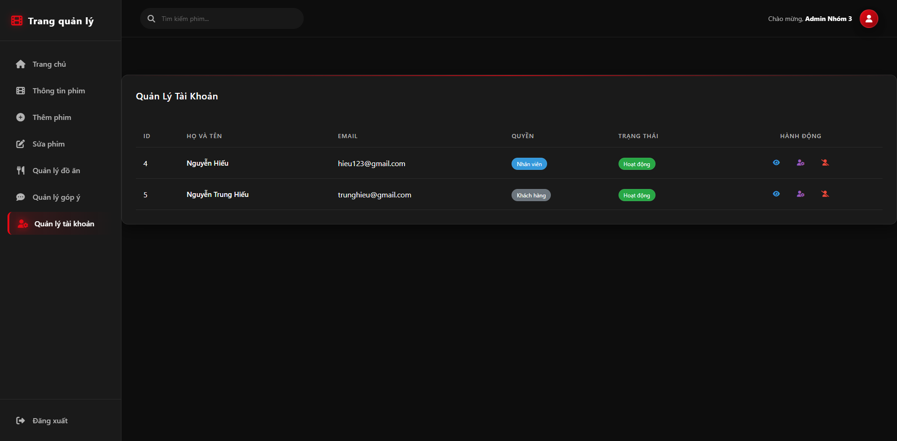
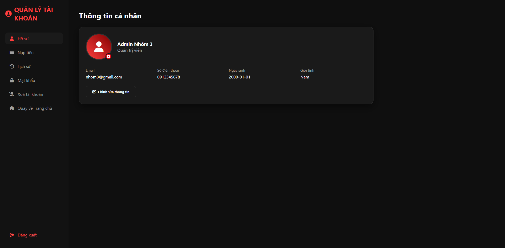
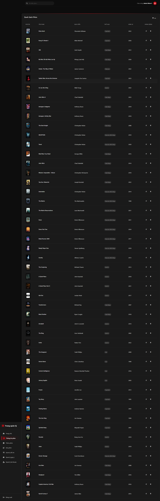
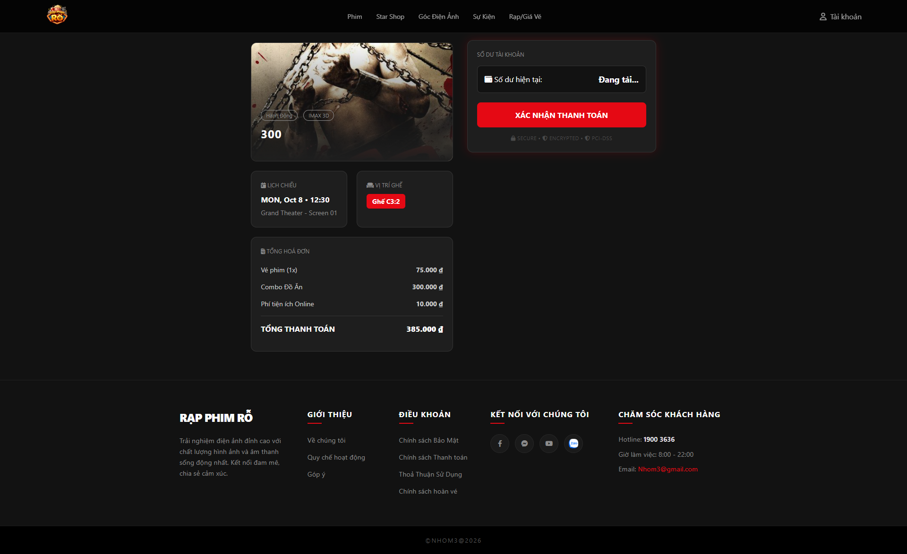

# 🎬 Movie Ticket Booking Management System

A full-stack web application for movie ticket booking and cinema management. The system supports user authentication, role-based authorization, movie management, account balance payments, and administrative functions.

## 📌 Features

### Customer Features

* User Registration
* User Login
* View Movie List
* View Movie Details
* Book Movie Tickets
* Pay Using Account Balance
* View Personal Information
* Update User Profile

### Employee Features

* Access Management Dashboard
* Manage Movie Information
* View Customer Data
* Monitor Ticket Transactions

### Admin Features

* Full Access to Administration Dashboard
* Create Movies
* Update Movies
* Delete Movies
* Manage Users
* Manage Employee Accounts
* Role-Based Authorization

## 🛠 Technologies Used

### Frontend

* HTML5
* CSS3
* JavaScript

### Backend

* Python
* Flask
* Flask-CORS

### Database

* SQL Server
* PyODBC

### Other Tools

* Git & GitHub
* Figma
* Python Dotenv
* Stitch

## 🏗 System Architecture

Frontend (HTML/CSS/JavaScript)

↓

Flask REST API

↓

SQL Server Database

## 👨‍💻 My Responsibilities

As a member of a 4-person team, I was responsible for:

* Developing frontend interfaces.
* Implementing backend APIs using Flask.
* Connecting the application with SQL Server.
* Building authentication and authorization features.
* Supporting system testing and debugging.

## 📸 Screenshots

### Login Page



### Signup Page


### Homepage



### Ticket-Booking



### Admin Dashboard



### User Dashboard



### Movie Management



### Payment Page



## ⚙️ Installation

### 1. Clone Repository

```bash
git clone <repository-url>
cd MovieTicket
```

### 2. Install Dependencies

```bash
pip install flask flask-cors pyodbc python-dotenv
```

### 3. Configure Environment Variables

Create a `.env` file in the project root directory:

```env
DB_SERVER=localhost\SQLEXPRESS
DB_NAME=Web_ban_ve
```

### 4. Create Database

Execute:

```text
database/database.sql
```

using SQL Server Management Studio (SSMS).

### 5. Run Application

```bash
python app.py
```

Backend Server:

```text
http://127.0.0.1:5000
```

## 📂 Project Structure

```text
MovieTicket/
│
├── app.py
├── README.md
├── requirements.txt
├── .env.example
├── .gitignore
│
├── database/
│   └── database.sql
│
├── docs/
│   └── screenshots/
│
├── html/
│	├──base/
│	├──components/
│	├──IMAGE/
│	├──layout/
│	├──script/
│	└──utilities/
	
```

## 🔐 Roles

### Customer

* Register Account
* Login
* Purchase Tickets
* Manage Personal Information

### Employee

* Manage Movie Information
* Monitor Transactions

### Administrator

* Full System Access
* User Management
* Employee Management
* Movie Management

## 🚀 Future Improvements

* Online Payment Gateway Integration
* Email Verification
* Password Encryption
* JWT Authentication
* Seat Selection System
* Revenue Statistics Dashboard
* Responsive Mobile Interface

## 📚 Learning Outcomes

Through this project, I improved my understanding of:

* Full-stack Web Development
* REST API Development with Flask
* SQL Server Database Design
* User Authentication & Authorization
* Team Collaboration
* Problem Solving and Debugging
